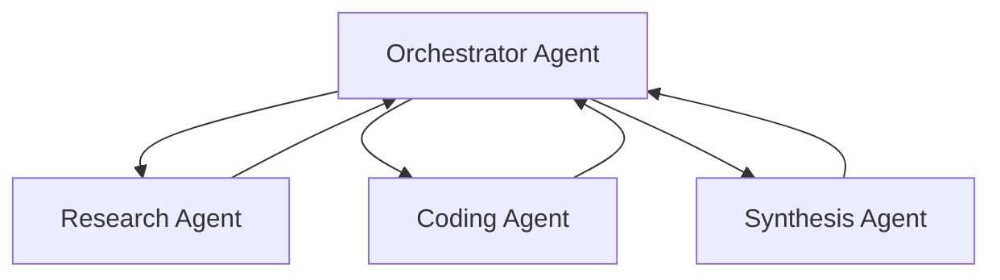

# DeepRezearch

DeepRezearch a simple multi agent system for **deep rezearch🥴**

## Overview
DeepRezearch is multi-agent system that helps you complete simple, multi-step tasks requiring information lookup, calculations, or a combination of both. System coordinates a set of specialized agents through an orchestrator agent. The orchestrator routes queries to the right agents and composes results

## Agents
- Orchestrator agent routes requests and composes outputs
- Research agent performs information retrieval and summarization
- Coding agent generates and verifies code snippets
- Synthesis agent combines results and produces final responses

## Architecture


## How to run
```bash
docker compose up -d
```
The compose file starts an Ollama model service and the FastAPI app

## GPU Suppport
Ollama container works with gpu. Hence, you need to install NVIDIA Container Toolkit:
```bash
curl -fsSL https://nvidia.github.io/libnvidia-container/gpgkey | sudo gpg --dearmor -o /usr/share/keyrings/nvidia-container-toolkit-keyring.gpg \
  && curl -s -L https://nvidia.github.io/libnvidia-container/stable/deb/nvidia-container-toolkit.list | \
    sed 's#deb https://#deb [signed-by=/usr/share/keyrings/nvidia-container-toolkit-keyring.gpg] https://#g' | \
    sudo tee /etc/apt/sources.list.d/nvidia-container-toolkit.list
sudo apt-get update
sudo apt-get install -y nvidia-container-toolkit

# Configure NVIDIA Container Toolkit
sudo nvidia-ctk runtime configure --runtime=docker
sudo systemctl restart docker

# Test GPU integration
docker run --gpus all nvidia/cuda:11.5.2-base-ubuntu20.04 nvidia-smi
```

## Notes
- The project expects an Ollama model named llama3.1 to be available when using docker compose
- Adjust model urls and names in environment variables or in main.py if needed

Developed with ❤️, ☕️ and a little bit with 🤬 for mr. Pudikov